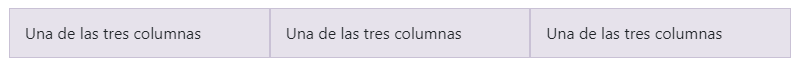
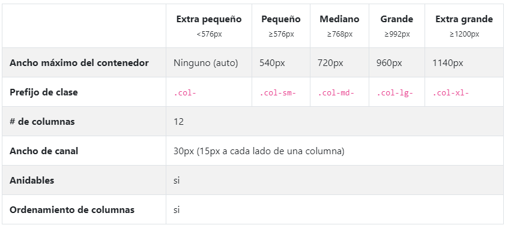
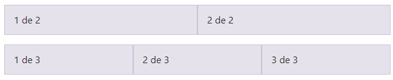
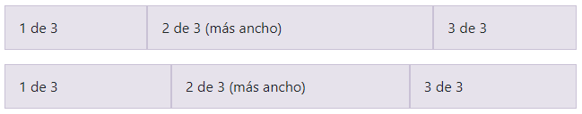
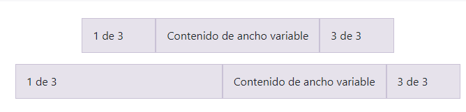
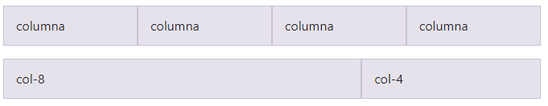
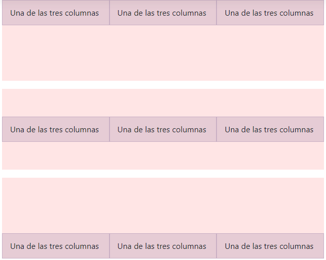
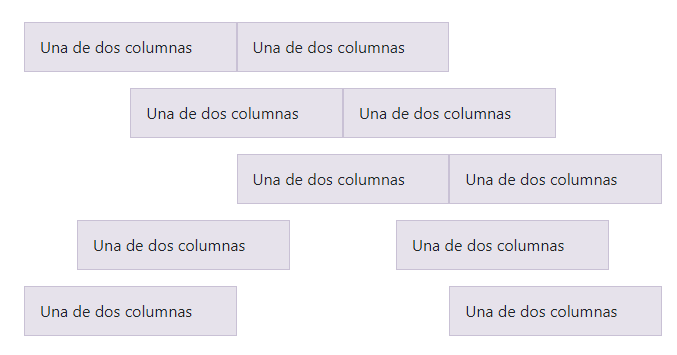

## Explicaciòn
 rejilla o grid es la base sobre la que construiremos el layout de nuestra página, es decir, la disposición de elementos. Es el componente esencial para asegurar que nuestra web se adaptará convenientemente a diferentes resoluciones y pantallas. Bootstrap utiliza un modelo de rejilla basado en dos tipos de contenedores y una rejilla de 12 columnas que resulta muy flexible, y que como veremos podemos también alterar cuando nos resulte conveniente.
## Introducción
Cuadrícula flexbox móvil primero para crear diseños de todas las formas y tamaños gracias a un sistema de doce columnas, cinco niveles de respuesta predeterminados, variables Sass y mixins, y docenas de clases predefinidas.  
El sistema de cuadrícula de Bootstrap utiliza una serie de contenedores, filas y columnas para diseñar y alinear el contenido. Está construido con flexbox y es totalmente sensible. A continuación se muestra un ejemplo y una mirada en profundidad sobre cómo se une la cuadrícula.
```html
<div class="container">
  <div class="row">
    <div class="col-sm">
      Una de tres columnas
    </div>
    <div class="col-sm">
      Una de tres columnas
    </div>
    <div class="col-sm">
      Una de tres columnas
    </div>
  </div>
</div>
```
 
El ejemplo anterior crea tres columnas de igual ancho en dispositivos pequeños, medianos, grandes y extragrandes utilizando nuestras clases de cuadrícula predefinidas. Esas columnas están centradas en la página con el padre .container 
Así es como funciona:
- Los contenedores proporcionan un medio para centrar y rellenar horizontalmente los contenidos de su sitio. Úselo .containerpara un ancho de píxel sensible o .container-fluidpara width: 100%todos los tamaños de dispositivo y ventana gráfica.
- Las filas son envoltorios para columnas. Cada columna tiene horizontal padding(llamado canalón) para controlar el espacio entre ellas. Esto paddingse contrarresta en las filas con márgenes negativos. De esta manera, todo el contenido de sus columnas se alinea visualmente en el lado izquierdo.
- En un diseño de cuadrícula, el contenido debe colocarse dentro de las columnas y solo las columnas pueden ser elementos secundarios inmediatos de las filas.
- Gracias a flexbox, las columnas de cuadrícula sin una especificada widthse diseñarán automáticamente como columnas de igual ancho. Por ejemplo, cuatro instancias de .col-smcada una tendrán automáticamente un 25% de ancho desde el punto de ruptura pequeño en adelante. Consulte la sección de columnas de diseño automático para obtener más ejemplos.
- Las clases de columna indican el número de columnas que le gustaría usar de las 12 posibles por fila. Entonces, si desea tres columnas de igual ancho, puede usar .col-4.
- Las columnas widthse establecen en porcentajes, por lo que siempre son fluidas y de tamaño relativo a su elemento padre.
- Las columnas tienen horizontal paddingpara crear las canaletas entre columnas individuales, sin embargo, puede eliminarlas de las marginfilas y paddingde las columnas con .no-guttersel .row.
- Para que la cuadrícula responda, hay cinco puntos de interrupción de la cuadrícula, uno para cada punto de interrupción sensible : todos los puntos de interrupción (extra pequeño), pequeño, mediano, grande y extra grande.
- Los puntos de interrupción de la cuadrícula se basan en consultas de medios de ancho mínimo, lo que significa que se aplican a ese punto de interrupción y a todos los que están por encima (por ejemplo, se .col-sm-4aplica a dispositivos pequeños, medianos, grandes y extra grandes, pero no al primer xspunto de interrupción).
- Puede usar clases de cuadrícula predefinidas (como .col-4) o Sass mixins para obtener un marcado semántico más.

## Opciones de la cuadricula
Mientras Bootstrap usa ems o rems para definir la mayoría de los tamaños, pxs se usan para puntos de corte de la cuadrícula y anchos de contenedor. Esto se debe a que el ancho de la vista está en píxeles y no cambia con el tamaño de la fuente .

Vea cómo funcionan los aspectos del sistema de cuadrícula Bootstrap en varios dispositivos con una tabla práctica.


## Diseño automatico en las columnas
## Ancho
Por ejemplo, aquí hay dos diseños de cuadrícula que se aplican a cada dispositivo y ventana gráfica, desde xshasta xl. Agregue cualquier cantidad de clases sin unidades para cada punto de interrupción que necesite y cada columna tendrá el mismo ancho.

```html
<div class="container">
  <div class="row">
    <div class="col">
      1 de 2
    </div>
    <div class="col">
      2 de 2
    </div>
  </div>
  <div class="row">
    <div class="col">
      1 de 3
    </div>
    <div class="col">
      2 de 3
    </div>
    <div class="col">
      3 de 3
    </div>
  </div>
</div>
```

Las columnas de igual ancho se pueden dividir en varias líneas, pero hubo un error de Safari Flexbox que impidió que esto funcionara sin un explícito flex-basiso border. Existen soluciones alternativas para versiones anteriores del navegador, pero no deberían ser necesarias si está actualizado.

## Establecer el ancho de una columna
El diseño automático para las columnas de cuadrícula flexbox también significa que puede establecer el ancho de una columna y hacer que las columnas hermanas cambien el tamaño automáticamente a su alrededor. Puede usar clases de cuadrícula predefinidas (como se muestra a continuación), mixins de cuadrícula o anchos en línea. Tenga en cuenta que las otras columnas cambiarán de tamaño sin importar el ancho de la columna central.
```html
<div class="container">
  <div class="row">
    <div class="col">
      1 of 3
    </div>
    <div class="col-6">
      2 of 3 (wider)
    </div>
    <div class="col">
      3 of 3
    </div>
  </div>
  <div class="row">
    <div class="col">
      1 of 3
    </div>
    <div class="col-5">
      2 of 3 (wider)
    </div>
    <div class="col">
      3 of 3
    </div>
  </div>
</div>
```


## Contenido de ancho variable
Use col-{breakpoint}-autoclases para dimensionar columnas en función del ancho natural de su contenido.
```html
<div class="container">
  <div class="row justify-content-md-center">
    <div class="col col-lg-2">
      1 of 3
    </div>
    <div class="col-md-auto">
      Variable width content
    </div>
    <div class="col col-lg-2">
      3 of 3
    </div>
  </div>
  <div class="row">
    <div class="col">
      1 of 3
    </div>
    <div class="col-md-auto">
      Variable width content
    </div>
    <div class="col col-lg-2">
      3 of 3
    </div>
  </div>
</div>
```

## Hileras múltiples de igual ancho
Cree columnas de igual ancho que abarquen varias filas insertando un lugar .w-100donde desea que las columnas se rompan en una nueva línea. Haga que los descansos sean receptivos al mezclarlos .w-100con algunas utilidades de pantalla receptivas .

## Todos los puntos de interrupción
Para cuadrículas que son iguales desde el dispositivo más pequeño hasta el más grande, use las clases .coly .col-*. Especifique una clase numerada cuando necesite una columna de tamaño particular; de lo contrario, siéntase libre de seguir .col.
```html
<div class="row">
  <div class="col">col</div>
  <div class="col">col</div>
  <div class="col">col</div>
  <div class="col">col</div>
</div>
<div class="row">
  <div class="col-8">col-8</div>
  <div class="col-4">col-4</div>
</div>
```

## Apilado a horizontal
Usando un único conjunto de .col-sm-*clases, puede crear un sistema de cuadrícula básico que comienza apilado antes de volverse horizontal con un punto de interrupción pequeño ( sm).
## Mezclar y combinar
¿No quieres que tus columnas simplemente se acumulen en algunos niveles de cuadrícula? Use una combinación de diferentes clases para cada nivel según sea necesario. Vea el siguiente ejemplo para tener una mejor idea de cómo funciona todo.
## Alineación
Use las utilidades de alineación de flexbox para alinear columnas vertical y horizontalmente.
## Alineamiento vertical
Ejemplo:
```html
<div class="container">
  <div class="row align-items-start">
    <div class="col">
      Una de las tres columnas
    </div>
    <div class="col">
      Una de las tres columnas
    </div>
    <div class="col">
      Una de las tres columnas
    </div>
  </div>
  <div class="row align-items-center">
    <div class="col">
      Una de las tres columnas
    </div>
    <div class="col">
      Una de las tres columnas
    </div>
    <div class="col">
      Una de las tres columnas
    </div>
  </div>
  <div class="row align-items-end">
    <div class="col">
      Una de las tres columnas
    </div>
    <div class="col">
      Una de las tres columnas
    </div>
    <div class="col">
      Una de las tres columnas
    </div>
  </div>
</div>
```

## Alineación horizontal
```html
<div class="container">
  <div class="row justify-content-start">
    <div class="col-4">
      Una de dos columnas
    </div>
    <div class="col-4">
      Una de dos columnas
    </div>
  </div>
  <div class="row justify-content-center">
    <div class="col-4">
      Una de dos columnas
    </div>
    <div class="col-4">
      Una de dos columnas
    </div>
  </div>
  <div class="row justify-content-end">
    <div class="col-4">
      Una de dos columnas
    </div>
    <div class="col-4">
      Una de dos columnas
    </div>
  </div>
  <div class="row justify-content-around">
    <div class="col-4">
      Una de dos columnas
    </div>
    <div class="col-4">
      Una de dos columnas
    </div>
  </div>
  <div class="row justify-content-between">
    <div class="col-4">
      Una de dos columnas
    </div>
    <div class="col-4">
      Una de dos columnas
    </div>
  </div>
</div>
```
