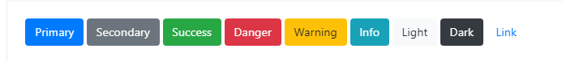

## Inicio
Bootstrap incluye varios estilos de botones predefinidos, cada uno con su propio propósito semántico, con algunos extras para mayor control.   
Tan solo poniendo la clase .btn, creamos un botón mas estilizado que el por defecto de HTML, agregando otra clase aparte de .btn podemos darles colores diferentes aquí el ejemplo: 
```html
<button type="button" class="btn btn-primary">Primary</button>
<button type="button" class="btn btn-secondary">Secondary</button>
<button type="button" class="btn btn-success">Success</button>
<button type="button" class="btn btn-danger">Danger</button>
<button type="button" class="btn btn-warning">Warning</button>
<button type="button" class="btn btn-info">Info</button>
<button type="button" class="btn btn-light">Light</button>
<button type="button" class="btn btn-dark">Dark</button>
<button type="button" class="btn btn-link">Link</button>
```

