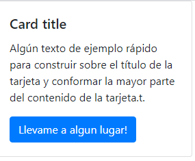
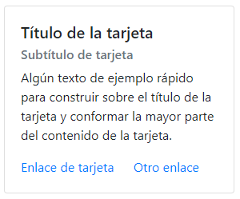

## Inicio
Son un contenedor de contenido flexible y extensible que puede tener diviersos usos. Aquí unos pocos ejemplos:
- Elementos
- Notas
- Encabezados
- Pies de pagina
- Logins
## ¿Cómo funciona?

Construidas con flexbox, ofrecen una fácil alineación y se mezclan bien con otros componentes Bootstrap. No tienen margin por defecto, así que use las utilidades de espaciado según sea necesario.
```html
<div class="card" style="width: 18rem;">
  
  <div class="card-body">
    <h5 class="card-title">Card title</h5>
    <p class="card-text">Algún texto de ejemplo rápido para construir sobre el título de la tarjeta y conformar la mayor parte del contenido de la tarjeta.t.</p>
    <a href="#" class="btn btn-primary">Llevame a algun lugar!</a>
  </div>
</div>
```


## Títulos, texto y enlaces.
Los títulos de las tarjetas se usan agregando ``.card-title`` a una ``<h>``etiqueta. Del mismo modo, los enlaces se agregan y se colocan uno al lado del otro al agregarlos .card-linka una ``<a>``etiqueta.

Los subtítulos se usan agregando un ``.card-subtitle`` a una ``<h>``etiqueta. Si las ``.card-titley`` los ``.card-subtitle`` elementos se colocan en un ``.card-body`` artículo, el título de la tarjeta y los subtítulos están alineados muy bien.
```html
<div class="card" style="width: 18rem;">
  <div class="card-body">
    <h5 class="card-title">Titulo de la tarjeta</h5>
    <h6 class="card-subtitle mb-2 text-muted">Subtitulo de la tarjeta/h6>
    <p class="card-text">Algun texto de ejemplo rapido para construir sobre el titulo de la tarjeta y conformar la mayor parte del contenido de la tarjeta.</p>
    <a href="#" class="card-link">Enlace de tarjeta</a>
    <a href="#" class="card-link">Otro enlace</a>
  </div>
</div>
```


