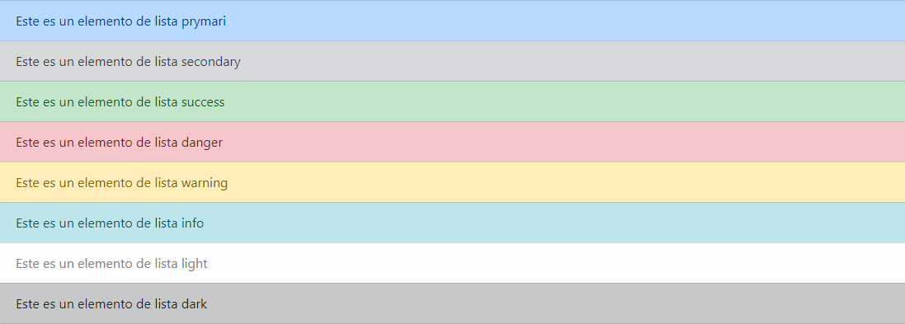

## Clases contextuales
Use clases contextuales para diseñar elementos de la lista con un fondo y color con estado.
```html
 <ul class="list-group">
      <li class="list-group-item list-group-item-primary">Este es un elemento de lista prymari</li>
      <li class="list-group-item list-group-item-secondary">Este es un elemento de lista secondary </li>
      <li class="list-group-item list-group-item-success">Este es un elemento de lista success </li>
      <li class="list-group-item list-group-item-danger">Este es un elemento de lista danger </li>
      <li class="list-group-item list-group-item-warning">Este es un elemento de lista warning </li>
      <li class="list-group-item list-group-item-info">Este es un elemento de lista info </li>
      <li class="list-group-item list-group-item-light">Este es un elemento de lista light </li>
      <li class="list-group-item list-group-item-dark">Este es un elemento de lista dark </li>
</ul>
```

