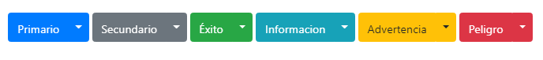

## Incio
Con un menu desplegable puedes mostrar listas de enlases de una manera muy estetica y facil de entender.
## ¿Cómo funciona?
Cualquier boton ``.btn`` se puede convertir en un menú desplegable con algunos cambios de marcado. Así es como puede ponerlos a trabajar con cualquiera de los ``<button>`` elementos:
```html
<div class="dropdown">
  <button class="btn btn-secondary dropdown-toggle" type="button" id="dropdownMenuButton" data-toggle="dropdown" aria-haspopup="true" aria-expanded="false">
    Dropdown button
  </button>
  <div class="dropdown-menu" aria-labelledby="dropdownMenuButton">
    <a class="dropdown-item" href="#">Action</a>
    <a class="dropdown-item" href="#">Another action</a>
    <a class="dropdown-item" href="#">Something else here</a>
  </div>
</div>
```
<dropdown></dropdown>
## Botones desplegables divididos
Utiliza``.dropdown-toggle-splitun`` y crearas una linea para que se note un submenu..
 
Usamos esta clase adicional para reducir el paddinga horizontal a cada lado del cursor en un 25% y eliminar la ``margin-left`` que se agrega para desplegar botones regularmente. Esos cambios adicionales mantienen el cursor centrado en el botón de división y proporcionan un área de impacto más adecuada al lado del botón principal.
```html
<div class="btn-group">
  <button type="button" class="btn btn-danger">Action</button>
  <button type="button" class="btn btn-danger dropdown-toggle dropdown-toggle-split" data-toggle="dropdown" aria-haspopup="true" aria-expanded="false">
    <span class="sr-only">Toggle Dropdown</span>
  </button>
  <div class="dropdown-menu">
    <a class="dropdown-item" href="#">Action</a>
    <a class="dropdown-item" href="#">Another action</a>
    <a class="dropdown-item" href="#">Something else here</a>
    <div class="dropdown-divider"></div>
    <a class="dropdown-item" href="#">Separated link</a>
  </div>
</div>
```
<dropdown2></dropdown2>
Aquí mas ejemplos agregando alguna de siguientes las clases ojo, esto solo es para cambiar el color.
- .primary  
- .secondary
- .success
- .danger
- .warning 
- .info
- .ligth
- .dark
- .white:


