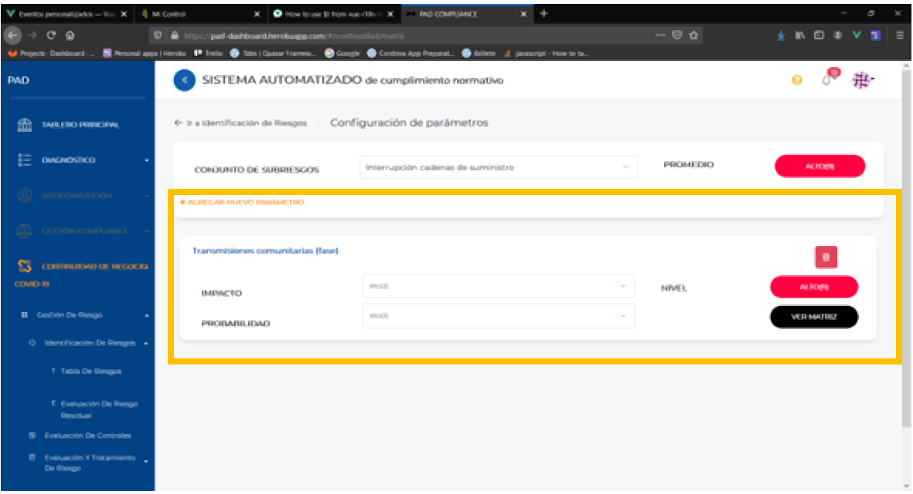
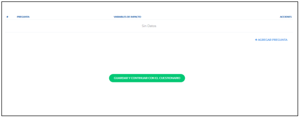
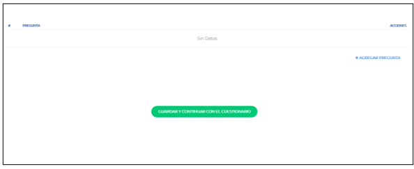

# Flujo cuestionarios

## Introducción

La solicitud del cliente consistía en asignar un par de cuestionarios (Cuestionario de probabilidad y cuestionario de impacto) a cada subriesgo, estos cuestionarios serán los encargados de calcular los valores de probabilidad e impacto de cada uno de los parámetros asignados a un subriesgo.



**Como el nombre lo dice, el `Cuestionario de probabilidad` dará valor a la variable `Probabilidad` del parámetro, así como el `Cuestionario de impacto` dará valor a la variable `Impacto`.**

Definición de datos de un ejemplo

El siguiente ejemplo será sobre el cual se estará trabajando a lo largo del documento.
Supongamos existe un subriesgo llamado `Subriesgo 1`, dicho subriesgo tendrá 4 parámetros:

- 1.- Parámetro 1
- 2.- Parámetro 2
- 3.- Parámetro 3
- 4.- Parámetro 4

## Si representamos el subriesgo con esta info en un objeto JSON se vería de la siguiente forma:

Si representamos el subriesgo con esta info en un objeto JSON se vería de la siguiente forma:

```json
{
	title: ‘Subriesgo 1’,
	id: 'idSubriesgo1'
	description: 'Este es el subriesgo 1'
	params: [
		{
			id: 'Param1'
			title: ‘Parametro 1’,
			impact: {value: null, label: null},
			probability: {value: 2, label: 'Probabilidad Baja'},
		},
		{
			id: 'Param2'
			title: ‘Parametro 2’,
			impact: {value: null, label: null},
			probability: {value: 2, label: 'Probabilidad Baja'},
		},
		{
			id: 'Param3'
			title: ‘Parametro 3’,
			impact: {value: null, label: null},
			probability: {value: 2, label: 'Probabilidad Baja'},
		},
		{
			id: 'Param4'
			title: ‘Parametro 4’,
			impact: {value: null, label: null},
			probability: {value: 2, label: 'Probabilidad Baja'},
		},
	]
}
```

_\_*NOTA: El JSON no contiene todos los campos existentes en la BD, solo se muestran los necesarios para ejemplificar.*_

## Enlazamiento entre subriesgo y sus 2 cuestionarios

Dado que los cuestionarios de un subriesgo serán independientes a otros cuestionarios de otros subriesgos, se necesita establecer algún dato que mapee los cuestionarios solamente a su subriesgo asignado, para poder reutilizar las API’s y las colecciones existentes, se tomaran como base las `secciones` (que son cuestionarios para la evaluación de controles) así como la colección de `questions` para almacenar las preguntas que tendrán los cuestionarios.  
La lógica que se tiene en las apis y colecciones, nos dice que los cuestionarios y sus preguntas están vinculadas por el campo `typeOf`, lo cual en la base de dato se ve así:

Para el cascaron de los cuestionarios se tendrá una estructura como la siguiente:

```json
{
	questions:[
		{
			typeOf:'section1'
			moduleId: 'penal',
			title: 'Sección 1',
			description: 'Descripción sección 1'
		},
		{
			typeOf:'idSubriesgo1IMP',
			moduleId: 'penal',
			title: 'Cuestionario impacto',
			description: 'Este es el subriesgo 1'
		}
		{
			typeOf:'idSubriesgo1PROB',
			moduleId: 'penal',
			title: 'Cuestionario probabilidad',
			description: 'Este es el subriesgo 1'
		}

	]
}
```

En este ejemplo se tiene un cuestionario vinculado a la sección 1 de evaluación de controles, y 2 cuestionarios vinculados a nuestro subriesgo, ¿Cómo sabemos que está vinculado a nuestro subriesgo?, porque el `typeOf` se compone del id del subriesgo precedido por `IMP` o `PROB` dependiendo del tipo de cuestionario (IMP para impacto y PROB para probabilidad)

Hasta aquí solo se puede ver el cascaron del cuestionario, ya que aún faltan las preguntas del mismo.

_NOTA: El campo “questions” se encuentra alojado en la colección `organizations`_

Para que esos cuestionarios se crearan se invoca la función `addQuestionnaireAssociateSubrisk` localizado en el archivo `IdentifyRisk.vue`, dicha función se invoca en el momento en que un nuevo subriesgo se crea.

```js
asyc asQuestionnaireAssociateSubrisk (newSubrisk){
	if(this.moduleId === 'anticorruption'){
		let `paramApi` = {
			access_token: this.access_token,
			description: newSubrisk.description,
			typeOf: newSubrisk._id + 'IMP',
			title: newSubrisk.title,
			moduleId: this.moduleId,
			questions: []
		}
		await this.$store.dispatch('section/newSection', paramsApi)
		paramsApi.typeOf = newSubrisk._id + 'PROB'
		await this.$store.dispatch('section/newSection', paramsApi)
	}	catch (error) {
		this.notifyError(error)
		this.writteGenericError("identifyRisk.vue", error, "Error assQuestionnaireAssociateSubrisk")
	}
}
```

Donde:

```js
access_token: this.access_token,     //Es el token de la secion
description: newSubrisk.description, //Descripcion del subriesgro
typeOf: newSubrisk._id + 'IMP',      //Id del subriesgo creado y el tipo de cuestionario
title: newSubrisk.title,             //Nombre del sub riesgo
moduleId: this.moduleId,			 //Modulo al que pertenece el sub riesgo
questions: []
```

Y se manda a invocar la acción de vuex

```js
await this.$store.dispatch("section/newSection", paramasApi);
```

Y así se crea el `Cuestionario de impacto`, para el `Cuestionario de probabilidad`, utilizamos los mismos datos, pero actualizamos el typeOf para que corresponda con el `Cuestionario de probabilidad` y de nuevo invocamos la acción de vuex.

```js
paramsApi.typeOf = newSubrisk._id 'PROB'
await this.$store.dispatch('section/newSection', paramApi)
```

Y así es como se crean los cuestionarios vacíos del nuevo subriesgo.

Cuando un subriesgo es eliminado se invoca el método `deleteQuestionnaireAssociateSubrisk` localizado también en el archivo `IdentifyRisk.vue`.

```js
async deleteAuestionnaireAssociateSubrisk (idSubrisk){
    if(this.moduleId){
        return
    }
try {
    let paramsApi = {
        access_token: this.access_token,
        moduleId: this.moduleId,
        subTypeOf: idSubrisk
    }
await this.$store.dispatch("selections/getSectionsProgressInfo", paramsApi)
	let sections = this.$store.state.sections.infoProgrssSections
	promise.all(sections.pam(async sections => {
	let param = {
    	id: section.questions._id,
    	access_token: this.access.tokenmm
    }
   		await this.$store.dispa('sections/deleteSection',param)
    })
   )
} catch (error){
    this.notifyError(error)
    this.writteGenericError("identifyRisk.vue", error,"Error addQuestionnaireAssociateSubrisk")
}
}
```

Donde:

```js
let `paramsApi`` = {
    access token: this.access token,     //Es el token de seción
    moduleId: this.moduleId,          // Modulo al que pertenece el subriesgo
    suvTypeOf: idSubrisk,                   // Is del subriesgo al eliminar
}
```

Y se utiliza;

```js
await this.$store.dispatch("sections/getSctionsProgressInfo", paramsApi);
let sections = this.$store.state.sections.infoProgressSections;
```

Para obtener los diversos cuestionarios asociados al subriesgo.

Y con el promise recorremos los cuestionarios y se procede a eliminarlos

```js
promise.all(sections.map(asyc section => {
	let param = {
	id: section.questions. id,            //Id del cuestionario
```

```js
access token: this.access.token    // Token de la seccion
	}
await this.$store.dispatch('sections/deleteSection', param)
})
```

Con esto se concluye la creación y destrucción de los cuestionarios de un subriesgo.

Para las preguntas de los cuestionarios se tendrá una estructura como la siguiente:
Para preguntas del **`Cuestionario de probabilidad`**:

```json
{
	title: 'Pregunta 1 de probabilidad',
	typeOf: 'idSubriesgo1PROB'
}
{
	title: 'Pregunta 2 de probabilidad',
	typeOf: 'idSubriesgo1PROB'
}

```

Para preguntas del “Cuestionario de impacto”:

```json
{
	title: 'Pregunta 1 de impacto',
	typeOf: 'idSubriesgo1IMP',
	impactVars:['Param1', 'Param3', 'Param4']
}
{
	title: 'Pregunta 2 de impacto',
	typeOf: 'idSubriesgo1IMP',
	impactVars:['Param1', 'Param2']
}

```

Como se puede aprecias la pregunta `Pregunta 1 de impacto` solo afectara a los parámetros:

- Parámetro 1
- Parámetro 3
- Parámetro 4

Mientras que la pregunta `Pregunta 2 de impacto` solo afectara a los parámetros:

- Parámetro 1
- Parámetro 2

Esto es porque en el campo impactVars se definieron los id’s de los parámetros que se verán afectados con esa dicha pregunta.

_NOTA: Para las estructuras de las preguntas, no se muestran todos los campos que existen en la BD, solo se muestran los mas relevantes para los cuestionarios_

### Agregar preguntas a los cuestionarios

Para agregar preguntas se utiliza la siguiente pantalla

`Cuestionario de impacto`



Ilustración 2 Vista para editar, crear y eliminar preguntas de `Cuestionario de impacto`

`Cuestionario de probabilidad`



Ilustración 3Vista para editar, crear y eliminar preguntas de `Cuestionario de probabilidad`

Como se puede apreciar la vista del `Cuestionario de impacto` tiene 2 columnas, una (Pregunta) para la pregunta como tal, y otra (Variables de impacto) para asignar los parámetros que sean afectados por la pregunta, mientras que “Cuestionario de probabilidad” solo tiene la columna “Pregunta”, ya que para `Probabilidad`, todos los parámetros se ven afectados de la misma forma por todas las preguntas del cuestionario.

Una vez que se termina de editar, crear y eliminar las preguntas, el usuario puede hacer click en `GUARDAR Y CONTINUAR CON EL CUESTIONARIO` (Nota: para poder ir al cuestionario debe existir siempre al menos una pregunta, ya que, si no, no se puede continuar al cuestionario).

### Cálculo de resultados de los cuestionarios

Como ya se mencionó, para el `Cuestionario de impacto` las preguntas tienen la característica de definir que parámetros se ven afectados y cuales no, mientras que `Cuestionario de probabilidad` sus preguntas afectan a todos por igual.

Bien, la base del cuestionario se encuentra en las dos posibles respuestas para cada pregunta:

- `Si`
- `No`

Donde `Si` tiene un valor de 1, y `No` tiene un valor de 0, estos valores serán contabilizados al final del cuestionario, por ejemplo, si se tienen 10 respuestas, donde 6 fueron contestadas con `Si` y 4 fueron contestadas con `No`, entonces la suma nos da un total de 6, y dicho valor será el que se colocara en los parámetros, este ejemplo podría aplicar perfecto para el `Cuestionario de probabilidad`, pero para el `Cuestionario de impacto` cambia un poco el método, para este caso en lugar de tener una sola suma, se tendrán múltiples sumas, cuantas? El mismo numero de parámetros, es decir para nuestro ejemplo base, descrito en [Definición de datos de un ejemplo], tenemos 4 parámetros, por lo tanto, tendremos 4 sumas diferentes, y cada una de las sumas podemos decir que está asociada a un parámetro, ahora, con ayuda de la variable `impactVars` de `question` (pregunta), podemos saber que suma será afectada con cada pregunta.

Recordando un poco nuestras preguntas de **`Cuestionario de impacto`**:

```json
{
	title: 'Pregunta 1 de impacto',
	typeOf: 'idSubriesgo1IMP',
	impactVars:['Param1', 'Param3', 'Param4']
}
{
	title: 'Pregunta 2 de impacto',
	typeOf: 'idSubriesgo1IMP',
	impactVars:['Param1', 'Param2']
}

```

Vemos que la pregunta uno afecta a los parámetros `Parámetro 1`, `Parámetro 3` y `Parámetro 4`, mientras que la pregunta 2 afecta a `Parámetro 1` Y `Parámetro 2`, con esto en mente entonces sabemos que tendremos 4 sumas (ya que tenemos 4 parámetros):

- sumaParam1
- sumaParam2
- sumaParam3
- sumaParam4

Ahora supongamos que la pregunta 1 se response con `Si` y la pregunta 2 con `No`, el resultado final, será:

- sumaParam1 = 1
- sumaParam2 = 0
- sumaParam3 = 1
- sumaParam4 = 1

Por otro lado, supongamos que ahora la pregunta 1 se response con `Si` y la pregunta 2 con `Si` también, el resultado final, será:

- sumaParam1 = 2
- sumaParam2 = 1
- sumaParam3 = 1
- sumaParam4 = 1

Como se puede observar, el `Parámetro 1` tendrá un valor de 2 ya que este parámetro se ve afectado por ambas preguntas, mientras que los otros parámetros solo se ven afectada por solo 1 de las 2 preguntas.

Con este ultimo ejemplo si lo reflejamos en la estructura JSON tendríamos:

```json
params: [
		{
			id: 'Param1'
			title: ‘Parámetro 1’,
			impact: {value: 2, label: 'Probabilidad Baja'},
			probability: {value: null, label: null},
		},
		{
			id: 'Param2'
			title: ‘Parámetro 2’,
			impact: {value: 1, label: 'Probabilidad muy baja'},
			probability: {value: null, label: null},
		},
		{
			id: 'Param3'
			title: ‘Parámetro 3’,
			impact: {value: 1, label: 'Probabilidad muy baja'},
			probability: {value: null, label: null},
		},
		{
			id: 'Param4'
			title: ‘Parámetro 4’,
			impact: {value: 1, label: 'Probabilidad muy baja'},
			probability: {value: null, label: null},
		},
	]

```

Para completar este ejemplo con los valores de probabilidad, vamos a suponer que las 2 preguntas de probabilidad que definimos con anterioridad:

```json
{
	title: 'Pregunta 1 de probabilidad',
	typeOf: 'idSubriesgo1PROB'
}
{
	title: 'Pregunta 2 de probabilidad',
	typeOf: 'idSubriesgo1PROB'
}
```

Son contestadas con 2 `Si`, lo cual nos da como resultado un 2 que se vera reflejado en todos los parámetros, quedando de la siguiente forma:

```json
params: [
		{
			id: 'Param1'
			title: ‘Parámetro 1’,
			impact: {value: 2, label: 'Probabilidad Baja'},
			probability: {value: 2, label: 'Probabilidad Baja'},
		},
		{
			id: 'Param2'
			title: ‘Parámetro 2’,
			impact: {value: 1, label: 'Probabilidad muy baja'},
			probability: {value: 2, label: 'Probabilidad Baja'},
		},
		{
			id: 'Param3'
			title: ‘Parámetro 3’,
			impact: {value: 1, label: 'Probabilidad muy baja'},
			probability: {value: 2, label: 'Probabilidad Baja'},
		},
		{
			id: 'Param4'
			title: ‘Parámetro 4’,
			impact: {value: 1, label: 'Probabilidad muy baja'},
			probability: {value: 2, label: 'Probabilidad Baja'},
		},
	]
```

Nota: Los `labels` asignados a los valores de `impacto` y `probabilidad` se pueden consultar en el Excel enviado por parte del cliente.

Y de esta forma se completa el ciclo de los cuestionarios para el llenado de resultados de los diversos parámetros asociados a un subriesgo.
