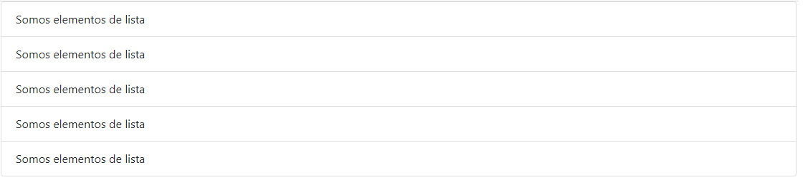
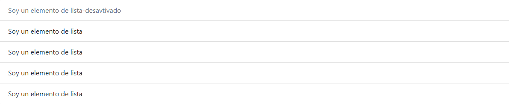
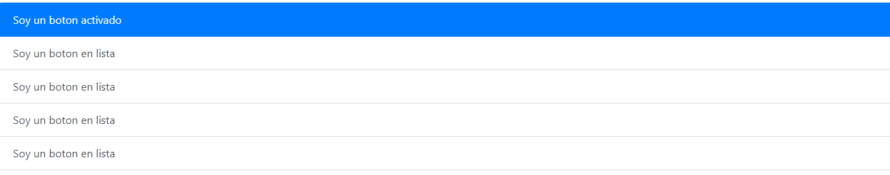

## List Groups
Con los grupos de lista podemos ordenar elementos de una manera muy rapida, ahorrandonos mucho tiempo.
Ejemplo:
```html
<div class="container">
      <ul class="list-group">
        <li class="list-group-item">Somos elementos de lista</li>
        <li class="list-group-item">Somos elementos de lista</li>
        <li class="list-group-item">Somos elementos de lista</li>
        <li class="list-group-item">Somos elementos de lista</li>
        <li class="list-group-item">Somos elementos de lista</li>
      </ul>
  </div> 
```

### Artículos activos
Agregar ``.active``a ``.list-group-item`` para indicar la selección activa actual.
```html
 <ul class="list-group">
      <li class="list-group-item active">Soy un elemento de lista</li>
      <li class="list-group-item">Soy un elemento de lista</li>
      <li class="list-group-item">Soy un elemento de lista</li>
      <li class="list-group-item">Soy un elemento de lista</li>
      <li class="list-group-item">Soy un elemento de lista</li>
  </ul>
```

### Artículos deshabilitados
Agrega ``.disabled ``a ``.list-group-item`` para que parezca deshabilitado.
```html
<ul class="list-group">
      <li class="list-group-item disabled">Soy un elemento de lista-desavtivado</li>
      <li class="list-group-item">Soy un elemento de lista</li>
      <li class="list-group-item">Soy un elemento de lista</li>
      <li class="list-group-item">Soy un elemento de lista</li>
      <li class="list-group-item">Soy un elemento de lista</li>
</ul>
```


### Enlaces y botones
Con ``.list-group-ítem-acción.`` Las pseudo clases son separadas para asegurar que los elementos no interactivos contenidos en los grupos de listas no proporcionen un click.
**Asegúrese de no usar las .btn clases estándar aquí .**
```html
<div class="list-group">
      <a href="#" class="list-group-item list-group-item-action active">
        Soy un boton activado
      </a>
      <a href="#" class="list-group-item list-group-item-action">Soy un boton en lista</a>
      <a href="#" class="list-group-item list-group-item-action">Soy un boton en lista</a>
      <a href="#" class="list-group-item list-group-item-action">Soy un boton en lista</a>
      <a href="#" class="list-group-item list-group-item-action">Soy un boton en lista</a>
</div>
```

