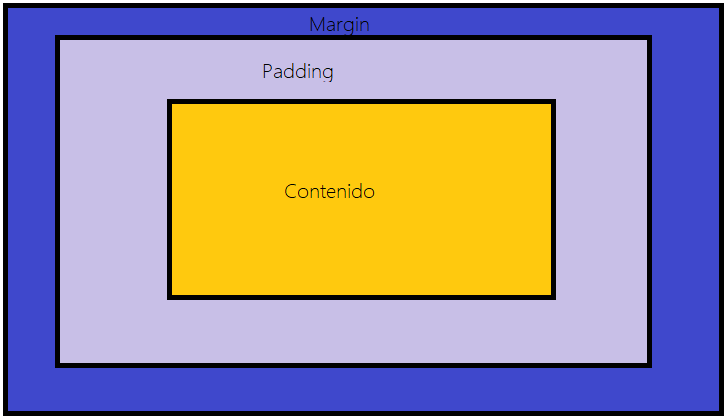

## Inicio
Podemos utilizar el padding y el margin desde las clases en Bootstrap 4, algo que nos hará acelerar el tiempo de desarrollo sin ninguna duda.   
Para ello podemos usar también el lado al que queremos afectar, por medio de:
- t: top
- b: bottom
- l: left
- r: right
- x: para left y right
- y: para top y bottom  

Dejemos en claro que el espacio se toma en valores entre 0 y 5, la explicación a continuación:
- 0 para eliminar el margin o el padding
- 1  - 0.25px
- 2  - 0.5px
- 3  - 1px, es decir que deja el espacio igual
- 4  - 1.5px
- 5  - 3px
- auto : para clases que queremos que tengan el margen o padding en auto


## Padding
Para utilizar alguno de las clases de Padding desde las clases de bootstrap 4 aqui los siguientes ejemplos de como vienen los tamaños establecidos: 
```html
.px-2 {
  padding-left: ($spacer * .5) !important;
  padding-right: ($spacer * .5) !important;
}

.p-3 {
  padding: $spacer !important;
}
```
## Margin
La propiedad CSS margin establece el espacio de relleno requerido por todos los lados de un elemento. El área de margin es el espacio entre el contenido del elemento y su borde ( border ) no se permiten valores negativos.
```html
<p class="bg-primary text-white text-center" style="height: 30px;">bg-primary</p>
<p class="bg-secondary text-white text-center" style="height: 30px;">bg-secondary</p>
```
<margin></margin>
Aquí estamos agregando mb-5 comparado con el código de arriba, desplazará el contenido ya que mb= margin-buttom:
```html
<p class="bg-primary text-white text-center" style="height: 30px;">bg-primary</p>
<p class="bg-secondary text-white text-center mt-5" style="height: 30px;">bg-secondary</p>
```  
<margin2></margin2>

## Margenes
En este ejemplo vemos como al agregar ml-5 desplazamos una caja hacia la izquierda
```html
<div class="bg-dark text-white" style="height: 100px; width: 100px;">bg-dark</div>
<div class="bg-success text-white" style="height: 100px; width: 100px;">bg-success</div>
```
<pading></pading>
## ml-5
```html
<div class="bg-dark text-white" style="height: 100px; width: 100px;">bg-dark</div>
<div class="bg-success text-white ml-5" style="height: 100px; width: 100px;">bg-success</div>
```
<pading2></pading2>

  

<!-- Es lo mas espaciado que podemos usar desde nuestra clase usando Bootstrap, para hacer espaciador mas grandes tendremos que hacerlo por nosotros mismos.  --> 
